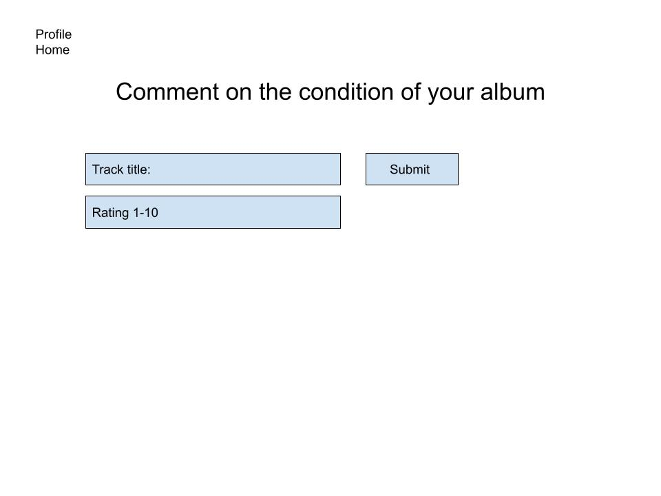
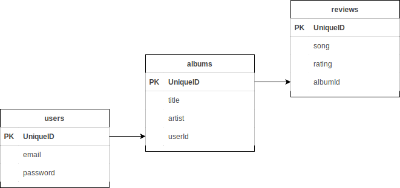

# PROJECT TWO

 
[link-to-site] (https://reimagined-waddle-tpalmer111.koyeb.app/)

## __Overview__

* This is an app where a user can search and store information about their (non-RESTful) music collection. Users will be able to catalog their favorite songs from each record in their collection. The app will utilize the last.FM api.  

## __User stories__

* As a user I want to be able to search for information related to albums released by my favorite musical artists.

* As a user I want to be able to keep a list of all of my records so I have an online catalog of my music collection.

* As a user I want to be able to keep a list a favorite tracks.

* As a user I want to record the format of my music (vinyl, tape, cd, etc.), the condition of the media, the condition of the case/cover, and any notes I want to make about each record. For example: if its a rare pressing or if its autographed, anything that isn't in one of the listed catagories.

* As a user it would be even better if I could just import my collection straight from Discogs, since I already have a Discogs user profile (stretch goal).

## __API__

* [LastFM-api] (https://www.last.fm/api/)

* [discogs-api] (http://www.discogs.com/developers/)

## __MVP GOALS__

1. Home page with welcome message, nav bar, and a website description.
2. Log in page for users to connect to their profile.
3. Sign up page for new users.
4. Search page form for users to find an album.
    * include a button to add album to user's library.
5. Profile page for users to view record library.
    * nav bar should include an update user information option.
    * albums should include a remove button.
    * albums should include an add to favorites button.
6. Favorites page for users to record their favorite tracks.
    

## __STRETCH GOALS__

1. CSS. Once functionality is achieved, styling is the first stretch goal priority. 
2. Add cover art and more album details.
3. Five star album rating system using radio buttons, and drop boxes for media/cover condition catagories (i.e. mint, near mint, very fine, etc.).
4. User profile pic.
5. Add functionality to import users actual discogs collection so they don't have to search one by one if they already are Discogs members.
    * Include a button to link to the real discogs site.

## __WIRE-FRAMES__

* .jpg)

* .jpg)

* .jpg)

* .jpg)

* 

* .jpg)

## __ERD__

* 

## __models__

createdb music_collection_database

sequelize model:create --name user --attributes email:string,password:string

sequelize model:create --name album --attributes title:string,artist:string,userId:integer

sequelize model:create --name review --attributes review:string,rating:integer,albumId:integer

sequelize model:create --name comment --attributes format:string,media:string,cover:string,note:string

## __CRUD__

CRUD | verb   | path                 | description                                  |
-----|--------|----------------------|----------------------------------------------|
R    | GET    | /                    | render the home page                         |
R    | GET    | /login               | render the log-in form                       |
R    | GET    | /new                 | render the sign-up form                      |
R    | GET    | /profile             | render the profile page                      |
R    | GET    | /search              | render the search form                       |
R    | GET    | /review             | render the add album review form              |
R    | GET    | /update              | render the update user form                  |
R    | GET    | /albums/:id          | show the details of an album                 |
R    | GET    | /albums/:id/review  | show the reviews of an album                  |
C    | POST   | /albums              | create a new album in user's profile         |
C    | POST   | /users               | create new user from the sign-up form        |
C    | POST   | /albums/:id/review  | add a new review to album at id               |
U    | PUT    | /users               | update user email or password                |
U    | PUT    | /reviews/:id        | update review if condition changes            |
D    | DELETE | /albums/:id          | remove album from profile                    |

### inspiration and developer notes

After a frustrating ordeal trying to decide on a project direction, I was procrastinating by clearing my email inbox. I came across an email from Discogs.com prompting me to review a seller from whom I had recently purchased a 7" record (flawed record but an otherwise satisfactory transaction). It then occurred to me they might have a public api. I guess sometimes, procrastination is the answer.

### post project reflection

...